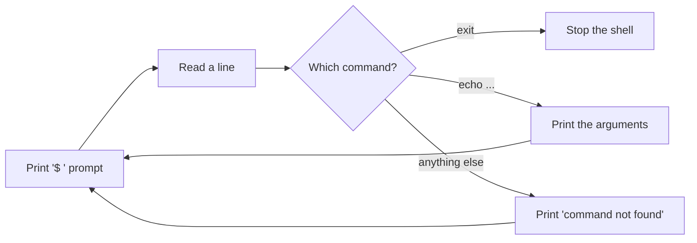

<div align="center">

# 🐚 Java Shell

**A POSIX-style shell built from scratch in Java, one stage at a time.**

[](https://app.codecrafters.io/users/parasparte12?r=2qF)


</div>

---

## 📖 About

This project is my solution to the
[**"Build Your Own Shell"**](https://app.codecrafters.io/courses/shell/overview) challenge on CodeCrafters.

The goal is to build a working shell — like `bash` or `sh` — that can read
commands, run builtins such as `echo` and `exit`, and eventually launch external
programs. Each stage adds one feature and is checked by automated tests.

Along the way it covers:

- 🔁 **REPLs** — the read → evaluate → print loop at the heart of every shell
- 🧩 **Command parsing** — splitting input into a command and its arguments
- 🛠️ **Builtin commands** — commands the shell handles itself
- ⚙️ **Process execution** — running programs found on `PATH` *(coming up)*

---

## ✨ Demo

```console
$ echo Hello, World!
Hello, World!
$ foo
foo: command not found
$ exit
```

---

## ✅ Progress

| Stage | Feature | Status |
|:-----:|---------|:------:|
| 1 | Print a prompt (`$ `) | ✅ |
| 2 | Report invalid commands | ✅ |
| 3 | REPL loop | ✅ |
| 4 | `exit` builtin | ✅ |
| 5 | `echo` builtin | ✅ |
| 6 | `type` builtin | ⏳ |
| 7 | Run external programs from `PATH` | ⏳ |
| 8 | `pwd` and `cd` builtins | ⏳ |
| 9 | Quoting, redirection and more | ⏳ |

---

## 🚀 Getting Started

### Prerequisites

- **Java 26** (or a recent JDK)
- **Maven** (`mvn`)

### Run the shell locally

```sh
git clone <your-repo-url>
cd codecrafters-shell-java
./your_program.sh
```

The script builds the project with Maven and starts the shell. Type a command
at the `$` prompt, or `exit` to quit.

### Submit to CodeCrafters

```sh
codecrafters submit
```

Test results are streamed straight to your terminal.

---

## 🗂️ Project Structure

```
codecrafters-shell-java/
├── src/main/java/
│   └── Main.java        # Shell entry point: prompt, REPL and builtins
├── pom.xml              # Maven build configuration
├── your_program.sh      # Builds and runs the shell locally
└── codecrafters.yml     # CodeCrafters settings (Java version, debug logs)
```

---

## 🧠 How It Works



The shell runs in an endless loop: it shows a prompt, reads what you type,
decides what to do with it, prints the result, then starts again.

---

<div align="center">

Built with ☕ by **[Paras](https://app.codecrafters.io/users/parasparte12?r=2qF)** as part of the
[CodeCrafters](https://codecrafters.io) Shell Challenge.

</div>
